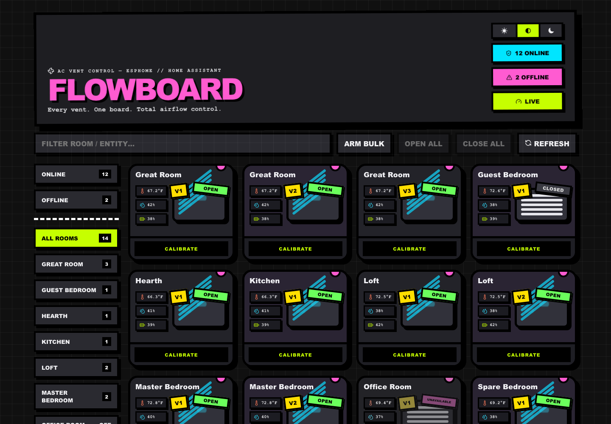
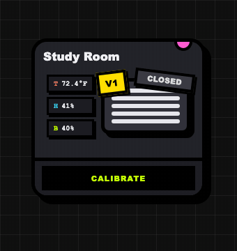
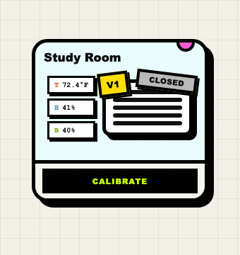

<div align="center">

# FLOWBOARD

**Every vent. One board. Total airflow control.**

A neo-brutalist web dashboard for DIY servo-actuated AC vents —
[ESPHome](https://esphome.io/) + [Home Assistant](https://www.home-assistant.io/) underneath,
a fun tactile board on top.

</div>

---



**Watch it work** — click a damper register and the slats tilt open, wind drifts
across, and the status ribbon flips through OPENING → OPEN:

| Dark | Light |
|:---:|:---:|
|  |  |

Flowboard turns a houseful of 3D-printed, ESP8266-driven AC vent dampers into a single
screen you actually enjoy using: click a damper register to open or close it, watch the
slats animate and the wind drift, tune each vent's servo endpoints, and see room
temperature, humidity, and sensor battery at a glance.

## Highlights

- 🌀 **The register IS the button** — animated damper slats tilt open/closed with a
  soft cloud-puff wind overlay; corner ribbons tag each vent (V1/V2/V3) and its status
- 🌡️ **Room sensors on every card** — temperature / humidity / battery chips, one
  room sensor shared across all its vents, low-battery warnings
- 🎛️ **Flip-in-place calibration** — tap CALIBRATE to tune open/closed servo
  endpoints without ever shifting the grid layout
- 🗂️ **4×4 single-screen grid** — every vent visible at once, no scrolling
- 🔍 **Left-rail filtering** — by room, online/offline status, plus a top search bar
- 🌗 **Light / dark / system themes** with persistence and no flash-of-wrong-theme
- ⚡ **Optimistic UI** — instant slat feedback, then background verification polling
  that absorbs ESPHome/HA state-report lag
- 🛡️ **Guarded bulk actions** — arm-before-use whole-home open/close
- 🧪 **Mock mode** — run the full UI against fake data without touching real vents
- 📦 **Single Docker image** — server-side HA proxy keeps your token out of the browser

## The hardware

Flowboard is the software half of a DIY smart-vent system. The mechanical design,
assembly guide, and flashing walkthrough live on Maker World:

> 🖨️ **[AC Vent Control — 3D model & build guide](https://makerworld.com/en/models/1444859-ac-vent-control#profileId-1504428)**

### Parts per vent

| Part | Example |
|---|---|
| Floor register (4×10") | [Adjustable steel floor register](https://www.amazon.com/dp/B0D8V61M4N) |
| MCU | [ESP8266 D1 Mini](https://www.amazon.com/gp/product/B0BKSKV54X) |
| Servo | [Micro servo (9g class)](https://www.amazon.com/dp/B072V529YD) |
| 3D-printed parts | Main body, servo gear, cover, teeth, hole guide — from the Maker World model |

### Room climate sensing (optional)

Flowboard displays temperature, humidity, and battery per room if you add a sensor.
Any Zigbee temperature/humidity sensor paired with Home Assistant works — it shows up
on every vent card in that room. Match by naming the entities
`sensor.<room>_temperature` / `sensor.<room>_humidity` (or any device whose friendly
name contains the room name). If a Room's matched sensors belong to the wrong device,
remap it with a Room Sensor Source — see [Configuration](#configuration).

### Wiring (from the build guide)

Servo → D1 Mini: **Red = 3V3, Black = GND, Yellow = D4** (PWM).

## How it works

```
┌──────────┐   REST API    ┌─────────────┐   REST API    ┌──────────────────┐
│ Browser  │ ────────────▶ │  Flowboard  │ ────────────▶ │  Home Assistant  │
│ (Vite +  │               │ Express     │               │  + ESPHome       │
│  React)  │ ◀──────────── │ server      │ ◀──────────── │  ESP8266 vents   │
└──────────┘   JSON        └─────────────┘   JSON        └──────────────────┘
```

The Express server holds your Home Assistant token (env vars only — never shipped to
the browser, never baked into the Docker image) and proxies vent discovery, switch
commands, and calibration writes. Vent cards are discovered automatically from HA
entity IDs following this convention:

| Purpose | Entity pattern | Example |
|---|---|---|
| Vent control | `switch.<room>_vent_<n>_vent_switch` | `switch.study_room_vent_1_vent_switch` |
| Open endpoint | `number.<room>_vent_<n>_set_open_position` | `number.study_room_vent_1_set_open_position` |
| Closed endpoint | `number.<room>_vent_<n>_set_closed_position` | `number.study_room_vent_1_set_closed_position` |
| Room sensors | `sensor.<room>_temperature` / `_humidity` / `_battery` | `sensor.study_room_temperature` |

A ready-to-flash ESPHome config matching this convention is in
[`docs/esphome-reference.yaml`](docs/esphome-reference.yaml) (credentials placeholdered —
generate your own keys).

## Quick start

### Docker (recommended)

```bash
docker build -t flowboard:local .
docker run -d --name flowboard -p 8788:8788 \
  -v "$(pwd)/config:/app/config:ro" \
  -e HASS_URL=http://homeassistant.local:8123 \
  -e HASS_TOKEN=replace-with-home-assistant-long-lived-access-token \
  --restart unless-stopped \
  flowboard:local
```

Open `http://localhost:8788`. The header stat reads **LIVE** when connected,
**MOCK MODE** when credentials are absent (safe demo with fake data).

Create the token in Home Assistant: profile → **Security** → **Long-Lived Access
Tokens** → Create Token.

> ⚠️ Store the token in an uncommitted `.env` file or your container runtime —
> see [`docker-compose.example.yml`](docker-compose.example.yml). Never bake it
> into the image.

### Local development

```bash
npm install
npm run dev:full        # Vite dev server (:5173) + Express (:8788), proxies /api
```

Useful scripts:

| Command | What it does |
|---|---|
| `npm test` | Vitest suite (discovery logic + UI behavior) |
| `npm run build` | Type-check + production bundle |
| `MOCK_HA=true npm run server` | API server alone with mock data |

## Configuration

### Environment

| Variable | Required | Purpose |
|---|---|---|
| `HASS_URL` | Live mode | Home Assistant base URL |
| `HASS_TOKEN` | Live mode | Long-lived access token — never bake into the image |
| `PORT` | No | HTTP port; defaults to `8788` |
| `MOCK_HA=true` | No | Force mock mode (no Home Assistant calls) |

Also accepted: `MOCK_HASS`, `APP_MODE=mock`, `HA_URL`, `HOME_ASSISTANT_URL`, `HA_TOKEN`, `HOME_ASSISTANT_TOKEN`.

If URL or token is missing (and mock is not forced), the server falls back to mock mode. Confirm with `GET /api/health`.

### Room Sensor Source (`config/flowboard.json`)

Keys and values are Room ids, not display names. A missing key means that Room uses its own sensors.

```json
{
  "roomSensorSources": {
    "kitchen": "hearth"
  }
}
```

The Docker image copies `config/` at build time. The Quick start `docker run` and both compose files bind-mount `./config` over `/app/config` so you can change mappings without rebuilding:

```bash
-v "$(pwd)/config:/app/config:ro"
```

If the file is missing or not valid JSON, Flowboard ignores it and uses an empty map (each Room keeps its own sensors). The server log line is `Flowboard config ignored`.

## Safety notes

- Bulk open/close requires **arming** first — no accidental whole-home commands
- The server rejects control requests for non-vent entities and out-of-range
  calibration values (−1.0 … 1.0 servo range)
- Unavailable vents show clearly (pink ribbon + disabled register) and refuse commands
- Mock mode (`MOCK_HA=true`) exercises the entire UI with zero HA calls — keep it on
  for demos and screenshots
- Home Assistant's IP ban (`login_attempts_threshold`) counts failed auth from your
  whole network — test tokens carefully, not repeatedly

## Project layout

```
├── config/         flowboard.json (Room Sensor Source map)
├── src/            React UI (cards, rail, themes, sensor chips)
├── server/         Express HA proxy, vent+sensor discovery, mock data
├── shared/         Types shared by client and server
├── docs/           ESPHome reference config, runbook, design history
├── sketches/       Interactive HTML design iterations (fan cards → ribbons)
└── Dockerfile      Multi-stage build → ~100MB alpine image
```

## Troubleshooting

| Symptom | Fix |
|---|---|
| Header says MOCK MODE in prod | `HASS_URL`/`HASS_TOKEN` missing or `MOCK_HA=true` is set — check `/api/health` |
| Vent missing from the board | Its entities must match the `switch.<room>_vent_<n>_vent_switch` pattern |
| Vent shows UNAVAILABLE | The ESPHome device is offline — check power/Wi-Fi; Flowboard disables its controls |
| No temp/humidity chips | No matching `sensor.<room>_*` entities; check entity naming |
| Wrong climate on a Room | Check `config/flowboard.json` Room Sensor Source keys (Room ids, not display names). Invalid JSON is ignored — empty map, own sensors |
| Calibration save rejected | Values must be numeric and within the vent's min/max (−1 … 1 by default) |

More detail in [`docs/FLOWBOARD_RUNBOOK.md`](docs/FLOWBOARD_RUNBOOK.md).

## Credits

- Hardware design & assembly guide: the
  [AC Vent Control model on Maker World](https://makerworld.com/en/models/1444859-ac-vent-control#profileId-1504428)
- Built on [ESPHome](https://esphome.io/), [Home Assistant](https://www.home-assistant.io/),
  [React](https://react.dev/), [Vite](https://vitejs.dev/), and [Express](https://expressjs.com/)

## License

MIT
